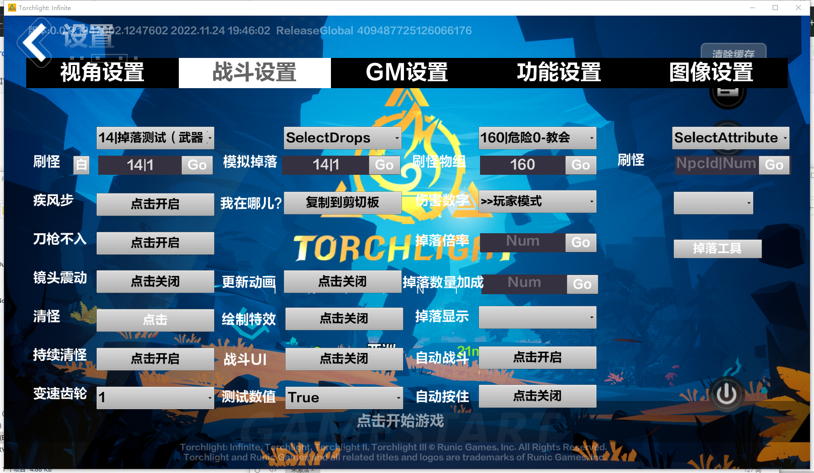

# Torchlight-Infinite-GM
火炬之光无限GM界面呼出

### 方法介绍：

##### 1.首先需要找到StaticFindObject函数的内存地址

x64dbg附加游戏，然后搜索字符串**"Illegal call to StaticFindObject() while serializing object data!"**即可定位StaticFindObject

##### 2.找到ProcessEvent函数的内存地址

##### 3.Call GM界面呼出函数

```c++
void CallGM()
{
 uintptr_t* QAHelperObject = SDKMgr::SDK_StaticFindObject(0, 0, L"/Script/UE_game.QAHelper", false);
uintptr_t* ConfigMenuFunc = SDKMgr::SDK_StaticFindObject(0, 0, L"/Script/UE_game.QAHelper:OpenConfigMenu", false);
struct {
    bool  bOpen;
} params;
SDKMgr::SDK_ProcessEvent(QAHelperObject, ConfigMenuFunc, &params);
printf("ProcessEvnet Call\n");   
}
```

##### 4.Hook游戏主线程call CallGM()



### 备注:

这是在一次逆向火炬之光无限时发现的一处有意思的功能。火炬内置提供给QA部门的测试GM插件，经过dump后可以看到有**QAHelper**这个ue类，当时初步怀疑可能是GM插件，然后找到类方法**OpenConfigMenu**可以打开该界面，经过测试后发现果然跟猜想的一致。

由于火炬是个强服务端的游戏，且GM面板中的GM总接口在release版本是关闭的。所以插件中的服务端功能都是无法使用的，但是在插件中我们可以看到很多有意思的东西。

提醒：

**这仅仅是一次技术分享**

